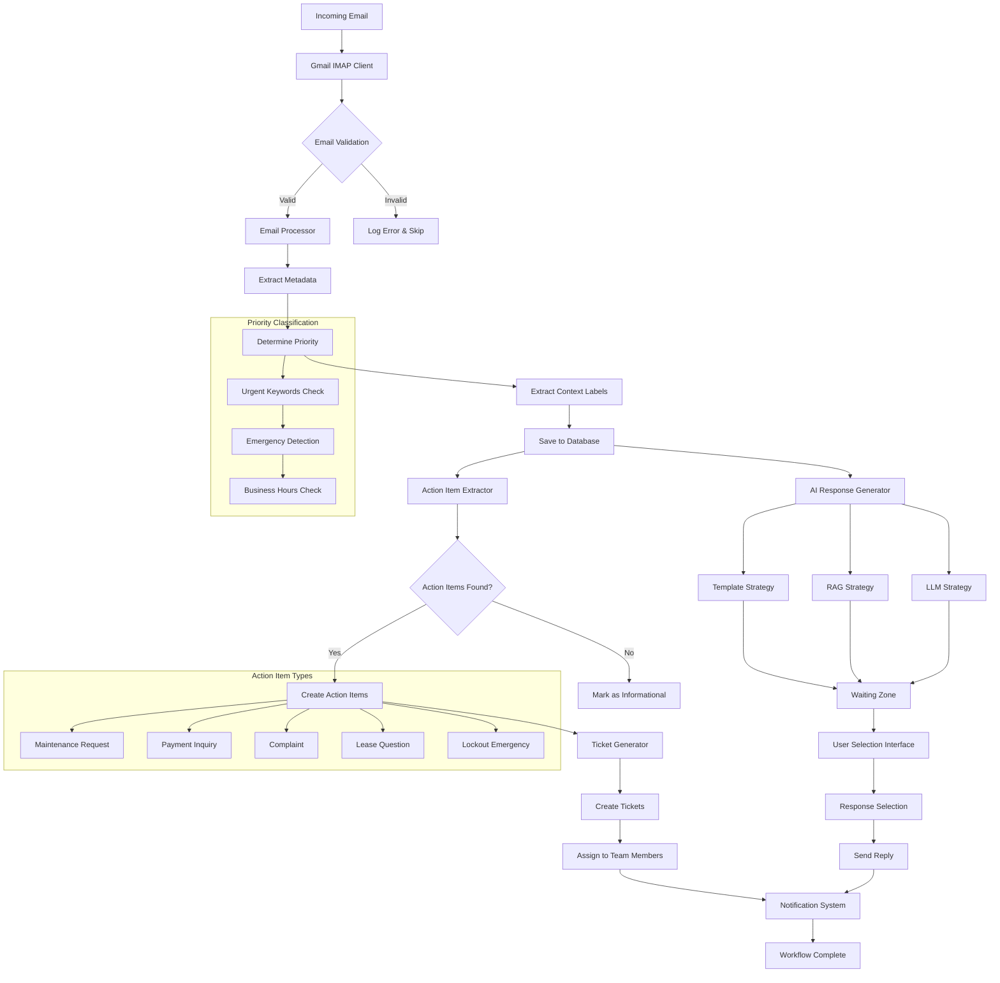

# Email Processing Workflow

## Complete Workflow Diagram



## Workflow Stages in Detail

### 1. Email Ingestion

**Gmail IMAP Integration**
```python
class GmailClient:
    def fetch_unread(self) -> List[Dict[str, Any]]:
        # Connect to Gmail IMAP
        self.imap = imaplib.IMAP4_SSL(self.host)
        self.imap.login(self.username, self.password)
        
        # Search for unread messages
        status, messages = self.imap.search(None, 'UNSEEN')
        
        # Process each email
        for eid in email_ids:
            raw_email = self.imap.fetch(eid, "(RFC822)")
            msg = email.message_from_bytes(raw_email)
            email_data = self._extract_email_data(msg)
```

**Email Data Structure**
```python
{
    "sender": "john.tenant@example.com",
    "subject": "Broken toilet in Unit 3B", 
    "body": "Hi, my toilet is overflowing...",
    "date": datetime(2025, 6, 17, 14, 30, 22),
    "raw_message": email_message_object
}
```

### 2. Email Processing & Classification

**Priority Level Determination**
```python
def _determine_priority_level(self, email_data: Dict[str, Any]) -> PriorityLevel:
    content = f"{email_data.get('subject', '')} {email_data.get('body', '')}".lower()
    
    # Urgent: Emergency keywords
    if any(keyword in content for keyword in self.urgent_keywords):
        return PriorityLevel.URGENT
        
    # High: Critical maintenance issues
    elif any(keyword in content for keyword in self.high_priority_keywords):
        return PriorityLevel.HIGH
        
    # High: Lockout situations
    elif self._contains_keywords(content, self.action_keywords['lockout']):
        return PriorityLevel.URGENT
        
    # High: General maintenance
    elif self._contains_keywords(content, self.action_keywords['maintenance']):
        return PriorityLevel.HIGH
        
    else:
        return PriorityLevel.MEDIUM
```

**Context Label Extraction**
- Maintenance: broken, fix, repair, leak, toilet, faucet, heater
- Payment: rent, payment, late fee, balance, deposit
- Complaint: noise, neighbor, disturbance, loud
- Lease: lease, contract, renewal, move out
- Lockout: locked out, lost key, access, door
- Amenity: pool, gym, laundry, parking

### 3. Action Item Extraction

**Action Item Types & Logic**
```python
def _extract_action_items(self, email_data: Dict[str, Any], email_id: str) -> List[Dict[str, Any]]:
    action_items = []
    content = f"{subject} {body}".lower()
    
    # Maintenance Request Detection
    if self._contains_keywords(content, self.action_keywords['maintenance']):
        action_items.append({
            "action": "create_maintenance_ticket",
            "category": "maintenance",
            "details": self._extract_maintenance_details(email_data),
            "priority": self._determine_priority(content),
            "tenant": self._get_or_create_tenant_info(sender),
            "unit": self._extract_unit_info(content),
            "estimated_cost": self._estimate_maintenance_cost(content),
            "requires_contractor": self._requires_contractor(content)
        })
    
    # Lockout Emergency Detection
    if self._contains_keywords(content, self.action_keywords['lockout']):
        action_items.append({
            "action": "emergency_lockout_assistance",
            "category": "lockout", 
            "priority": "urgent",
            "response_time_required": "immediate",
            "after_hours": self._is_after_hours()
        })
    
    # Additional action types...
    return action_items
```

**Unit Information Extraction**
```python
def _extract_unit_info(self, content: str) -> str:
    patterns = [
        r'apt\s*(\w+)',      # "apt 3B"
        r'apartment\s*(\w+)', # "apartment 3B"  
        r'unit\s*(\w+)',     # "unit 3B"
        r'#(\w+)',           # "#3B"
        r'room\s*(\w+)',     # "room 3B"
        r'suite\s*(\w+)'     # "suite 3B"
    ]
    
    for pattern in patterns:
        match = re.search(pattern, content, re.IGNORECASE)
        if match:
            return f"Unit {match.group(1).upper()}"
    
    return "Unit not specified"
```

### 4. Ticket Creation

**Ticket Schema Generation**
```python
class Ticket:
    def _build_ticket_data(self) -> Dict[str, Any]:
        # Extract content for analysis
        subject = self.email_data.get('subject', '')
        body = self.email_data.get('body', '')
        content = f"{subject} {body}"
        
        # Determine categorization
        category, request_type = CategoryMapper.determine_category_from_content(content)
        subcategory = CategoryMapper.determine_subcategory(content, category)
        urgency = CategoryMapper.determine_urgency(content)
        
        # Extract property information
        unit_info = PropertyInfoExtractor.extract_unit_info(content)
        property_id = PropertyInfoExtractor.generate_property_id(unit_info)
        
        # Get assignment
        assignment_group, assigned_to = AssignmentMapper.get_assignment(category, subcategory)
        
        return TicketSchemaValidator.create_ticket_schema(
            short_description=self._generate_short_description(subject, category),
            description=self._generate_full_description(content, action_data),
            category=category,
            subcategory=subcategory,
            request_type=request_type,
            urgency=urgency,
            property_id=property_id,
            unit_number=unit_info,
            requested_for=self.email_data.get('sender', ''),
            assignment_group=assignment_group,
            assigned_to=assigned_to
        )
```

**Automatic Assignment Logic**
```python
ASSIGNMENT_MAPPING = {
    TicketCategory.MAINTENANCE.value: {
        'assignment_group': 'Property Maintenance',
        'assigned_to': 'maintenance@property.com'
    },
    TicketCategory.COMPLAINT.value: {
        'assignment_group': 'Property Management', 
        'assigned_to': 'manager@property.com'
    }
}

SPECIALIST_ASSIGNMENTS = {
    TicketSubcategory.PLUMBING.value: 'plumber@property.com',
    TicketSubcategory.ELECTRICAL.value: 'electrician@property.com',
    TicketSubcategory.HVAC.value: 'hvac@property.com'
}
```

### 5. AI Response Generation

**Multi-Strategy Response Generation**
```python
def generate_reply(self, email_data: Dict[str, Any], email_id: str) -> List[Dict[str, Any]]:
    responses = []
    tenant_name = self._extract_tenant_name(email_data.get('sender', ''))
    email_content = f"Subject: {email_data.get('subject', '')}\n{email_data.get('body', '')}"
    
    # 1. RAG-based response (if available)
    if self.rag_system.vector_store:
        rag_response = self._generate_rag_response(email_content, tenant_name)
        if rag_response:
            responses.append({
                'content': rag_response,
                'strategy_used': 'rag',
                'provider': 'langchain_faiss',
                'confidence': 0.85
            })
    
    # 2. LLM responses from available models
    for model_name in self.llm_manager.get_available_models()[:2]:
        try:
            llm_response = self._generate_llm_response(model_name, email_content, tenant_name)
            responses.append({
                'content': llm_response,
                'strategy_used': 'llm',
                'provider': model_name,
                'confidence': 0.8 if 'gpt4' in model_name else 0.7
            })
        except Exception as e:
            logger.error(f"Error with model {model_name}: {e}")
    
    # 3. Template-based response (fallback)
    template_response = self._generate_template_response(email_data, tenant_name)
    responses.append({
        'content': template_response,
        'strategy_used': 'template',
        'provider': 'predefined_template',
        'confidence': 0.75
    })
    
    return responses
```

### 6. Response Selection & Learning

**Waiting Zone System**
```python
def save_ai_responses_to_waiting_zone(email_id: str, response_options: List[Dict[str, Any]]) -> str:
    ai_response_data = {
        'id': str(uuid.uuid4()),
        'email_id': email_id,
        'response_options': response_options,
        'status': 'pending_selection',
        'created_at': datetime.now().isoformat()
    }
    
    ai_responses_table.insert(ai_response_data)
    return ai_response_data['id']
```

**User Selection Process**
```python
def select_ai_response(email_id: str, option_id: str, rating: float = None, 
                      modifications: str = None) -> bool:
    # Find selected option
    selected_option = find_option_by_id(option_id)
    
    # Apply modifications if provided
    final_content = modifications if modifications else selected_option['content']
    
    # Save to replies table
    reply_data = {
        'email_id': email_id,
        'content': final_content,
        'strategy_used': selected_option['strategy_used'], 
        'provider': selected_option['provider'],
        'user_rating': rating,
        'modifications_made': modifications is not None,
        'original_content': selected_option['content'] if modifications else None
    }
    
    # Update email status
    EmailMessage.update_status(email_id, EmailStatus.RESPONDED)
    
    return True
```

## Workflow Performance Metrics

### Processing Times (Average)
- **Email Validation**: 50-100ms
- **Content Analysis**: 200-500ms  
- **Action Item Extraction**: 300-800ms
- **Ticket Creation**: 500-1000ms
- **AI Response Generation**: 2-8 seconds
- **Total Workflow**: 3-10 seconds per email

### Success Rates
- **Email Processing**: 98-99%
- **Action Item Detection**: 85-95%
- **Ticket Creation**: 90-98%
- **AI Response Generation**: 85-95%

### Scalability Considerations
- **Concurrent Emails**: Up to 20 simultaneous
- **Daily Volume**: 500+ emails
- **Response Queue**: 100+ pending selections
- **Database Growth**: ~1GB per 10,000 emails

## Error Handling & Recovery

### Email Processing Errors
```python
try:
    email_record = email_processor.process_email(email_data)
except Exception as e:
    logger.error(f"Email processing failed: {e}")
    # Save email with error status
    EmailMessage.create(
        sender=email_data['sender'],
        subject=email_data.get('subject', ''),
        body=email_data.get('body', ''),
        status=EmailStatus.ERROR,
        error_message=str(e)
    )
```

### AI Response Failures
```python
try:
    response_options = ai_responder.generate_reply(email_data, email_id)
except Exception as e:
    logger.error(f"AI response generation failed: {e}")
    # Fallback to template-only response
    response_options = [create_template_fallback(email_data)]
```

### Recovery Mechanisms
- **Retry Logic**: Failed operations retry up to 3 times
- **Fallback Strategies**: Template responses when AI fails
- **Manual Intervention**: Failed emails flagged for human review
- **Health Monitoring**: Automatic alerts for system issues