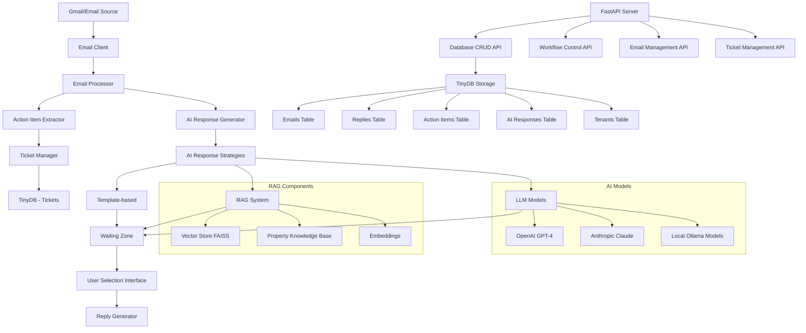

# System Architecture

```mermaid
graph TB
    A[Gmail/Email Source] --> B[Email Client]
    B --> C[Email Processor]
    
    C --> D[Action Item Extractor]
    C --> E[AI Response Generator]
    
    D --> F[Ticket Manager]
    F --> G[TinyDB - Tickets]
    
    E --> H[AI Response Strategies]
    H --> I[Template-based]
    H --> J[RAG System]
    H --> K[LLM Models]
    
    I --> L[Waiting Zone]
    J --> L
    K --> L
    
    L --> M[User Selection Interface]
    M --> N[Reply Generator]
    
    O[FastAPI Server] --> P[Database CRUD API]
    O --> Q[Workflow Control API]
    O --> R[Email Management API]
    O --> S[Ticket Management API]
    
    P --> T[TinyDB Storage]
    T --> U[Emails Table]
    T --> V[Replies Table]
    T --> W[Action Items Table]
    T --> X[AI Responses Table]
    T --> Y[Tenants Table]
    
    subgraph "AI Models"
        K1[OpenAI GPT-4]
        K2[Anthropic Claude]
        K3[Local Ollama Models]
        K --> K1
        K --> K2
        K --> K3
    end
    
    subgraph "RAG Components"
        J1[Vector Store FAISS]
        J2[Property Knowledge Base]
        J3[Embeddings]
        J --> J1
        J --> J2
        J --> J3
    end
```